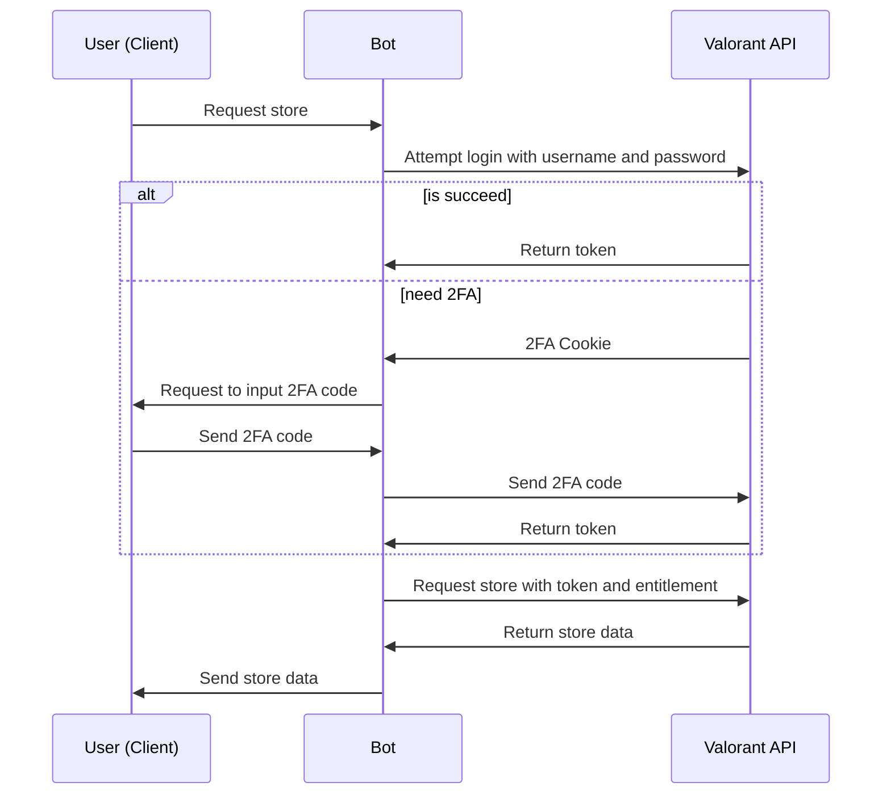
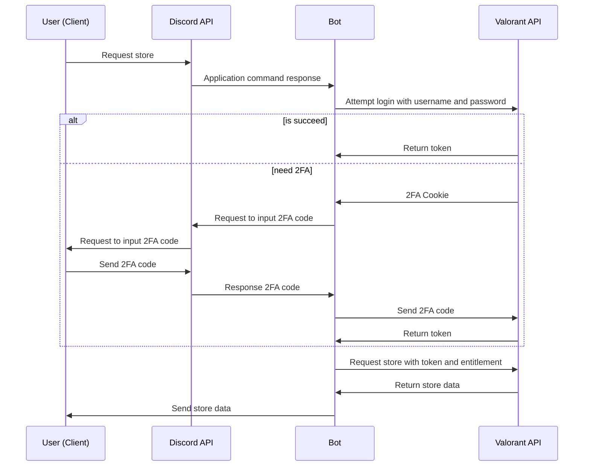

## Bootstrap and run

Duplicate `config/config.template.exs` and rename it to `config/config.exs`,
then change `YOUR BOT TOKEN` to your bot token

```
mix deps.get
mix run --no-halt

# OR if you want to debug the bot do this:

iex -S mix
```

## Note
`flags: 64` is used for ephemeral message in component.

## Flow

A common store flow:


A common, but has Discord API flow in the store flow:

